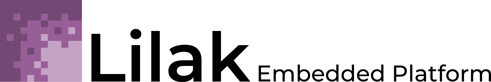

  

---

Lilak is an operating system designed for user-facing embedded devices like smartwatches, wearable displays, and Internet-of-Things appliances. 
Influenced by the Pebble operating system, Lilak aims to be a universal platform for distributing and running applications on low-end computer systems and microcontrollers. 

---

# Philosophy (and goals) #

To be effective, Lilak needs to focus on two things: making it easy to write complex applications and having those applications run on everything.

## Run everywhere ##

Lilak runs on top of other RTOS kernels and avoids making any assumptions about the underlying hardware, making porting to new platforms a snap. 

## Hardware independence ##

Lilak devices won't be homogenous - they'll likely have wildly different screen sizes, resolutions, input methods, etc. 
Lilak will use helper functions to abstract the details of a platform away from developers, allowing applications to run on very different devices with no extra effort. 

## Native apps with the convenience of a VM ##

Native applications are ideal for small devices that can't support the overhead of a virtual machine, but usually they require applications to be compiled individually for each platfom they run on.
Lilak's built-in abstraction layer will mean you only need to complile one version of your app per architecture (eg. ARM, MIPS, x86, etc.) - and the SDK will handle this automatically. 

## Developer friendly ##

Lilak will make developing functional and good-looking applications a dream. 
Platform differences will be handled automatically by Lilak, so developers won't have to worry about the details of the hardware they want their applications to run on.
Lilak will also include a library of icons, fonts, and sounds designed for small devices, so developers can publish consistent-looking applications without needing to be an artist.
The SDK will assist the developer in packaging and maintaining applications for all of Lilak's supported architectures.

---

# Where we're at #

Currently planning and writing the lowest levels of the HAL. Watch this space for a proper roadmap by late July, and of course if you have questions/comments/suggestions please message me. 

